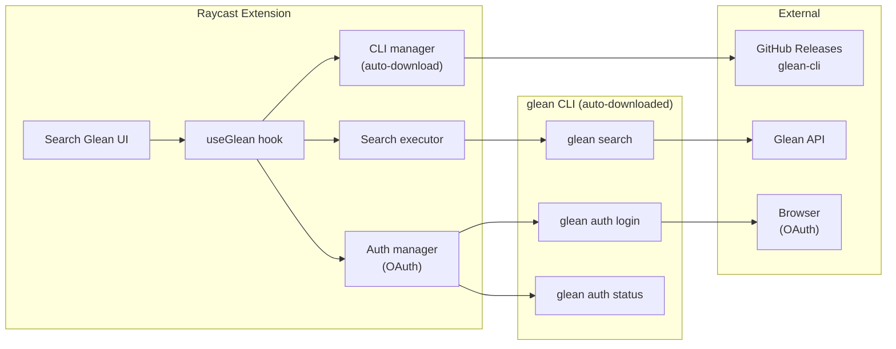

<h1 align="center">Glean Search</h1>

<p align="center">
  <a href="https://github.com/faizhasim/glean-search/blob/main/LICENSE"></a>
  <a href="https://www.raycast.com/faizhasim/glean-search"></a>
  <a href="https://www.typescriptlang.org"></a>
  <a href="https://vitest.dev"></a>
</p>

<p align="center">Search your company's knowledge base via <a href="https://glean.com">Glean</a> directly from Raycast.</p>

<p align="center"><strong>Quick links:</strong> <a href="#quick-start">Quick Start</a> · <a href="#features">Features</a> · <a href="#commands">Commands</a> · <a href="#architecture">Architecture</a> · <a href="CHANGELOG.md">Changelog</a></p>

---

## Quick Start

> **Note:** The extension is pending Raycast Store approval. For now, install from source:

```bash
git clone https://github.com/faizhasim/glean-search.git
cd glean-search
npm install && npm run build
```

Then open **Search Glean** in Raycast (add via `raycast://extensions/faizhasim/glean-search/search-glean` or use **Import Extension** in Raycast).

Once approved, install from the [Raycast Store](https://www.raycast.com/faizhasim/glean-search).

1. **Sign in** — the first time, you'll be asked for your work email to look up your Glean instance. A browser opens for OAuth authentication. After that, you're signed in automatically on future launches.

> **Note:** Your work email is used once to discover your Glean instance. The server URL is cached in `~/.glean/config.json` — no configuration needed on subsequent runs.

---

## Features

| Feature                          | Description                                                                                                                                                    |
| -------------------------------- | -------------------------------------------------------------------------------------------------------------------------------------------------------------- |
| **Search across connected apps** | Query indexed content from Glean's 100+ connectors (Google Workspace, Slack, Jira, GitHub, Confluence, and more)                                               |
| **OAuth authentication**         | Browser-based OAuth flow. No tokens to configure.                                                                                                              |
| **Auto-downloads glean CLI**     | The `glean` CLI binary is downloaded from GitHub Releases on first launch with SHA-256 verification. No manual installation needed.                            |
| **No configuration needed**      | `gleanHost` and `gleanCliPath` preferences have been removed. Instance discovery happens via your email — the extension looks up the server URL automatically. |
| **Open in browser**              | Press `Enter` to open a result in your default browser.                                                                                                        |
| **Copy URL**                     | Press `Cmd+C` to copy a result URL to your clipboard.                                                                                                          |
| **Result previews**              | Each result shows title, datasource, and a snippet preview.                                                                                                    |

---

## Commands

| Command          | Description                                                                            |
| ---------------- | -------------------------------------------------------------------------------------- |
| **Search Glean** | Search your company's knowledge base. Type a query, browse results, open or copy URLs. |

---

## Architecture



| Layer        | Stack                                                                                   |
| ------------ | --------------------------------------------------------------------------------------- |
| **Runtime**  | [Raycast](https://raycast.com) — native macOS extension                                 |
| **Language** | [TypeScript](https://typescriptlang.org)                                                |
| **UI**       | [@raycast/api](https://developers.raycast.com) — List, Form, Actions                    |
| **CLI**      | [glean-cli](https://github.com/gleanwork/glean-cli) — auto-downloaded, SHA-256 verified |
| **Auth**     | OAuth via `glean auth login` — email-based instance discovery, browser flow             |
| **Testing**  | [Vitest](https://vitest.dev) — CLI, auth, and integration test suites                   |

### Project Structure

```
src/
├── search-glean.tsx       # Command entry point — UI, search, auth orchestration
├── lib/
│   ├── cli.ts             # glean CLI auto-download, cache, discovery
│   ├── cli.test.ts        # CLI module tests
│   ├── auth.ts            # OAuth sign-in, auth status checking
│   ├── auth.test.ts       # Auth module tests
│   ├── glean.ts           # useGlean hook — CLI+auth+search orchestration
│   └── types.ts           # Shared TypeScript types
```

---

## CLI Management

The extension downloads the `glean` CLI binary automatically from [GitHub Releases](https://github.com/gleanwork/glean-cli/releases) on first launch. The binary is cached and verified via SHA-256 checksums.

If you prefer to manage the CLI yourself:

```
brew install gleanwork/tap/glean-cli
```

The extension discovers a system-installed binary before falling back to auto-download.

---

## Development

```
# Install dependencies
npm install

# Run tests
npm test

# Run with live reload
npm run dev

# Lint
npm run lint
```

---

## License

[MIT](LICENSE)
