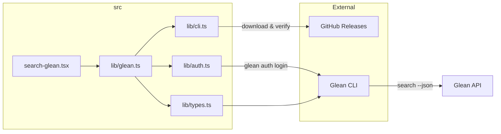

# Development

## Project structure




```
glean-search/
  src/
    search-glean.tsx    -- main Raycast command (React component)
    lib/
      glean.ts          -- Glean state hook (CLI discovery, auth, search)
      cli.ts            -- CLI binary resolution and auto-download
      auth.ts           -- OAuth sign-in and authentication checks
      types.ts          -- shared TypeScript types
  __mocks__/            -- Vitest mocks for Node.js modules
  package.json
  tsconfig.json
  vitest.config.ts
```

## Local development

### Setup

```bash
npm install
npm run dev
```

The `dev` script opens Raycast with your local checkout linked. Changes to source files are picked up automatically.

### Code style

- TypeScript with strict mode enabled
- ESLint (`@raycast/eslint-config`) for linting
- Prettier for formatting

Run the linter:

```bash
npm run lint
npm run fix-lint  # auto-fix
```

### Building

```bash
npm run build
```

This runs `ray build -e dist`, producing an optimised extension bundle.

### Publishing

Only the repository owner can publish to the Raycast Store:

```bash
npm run publish
```

The command runs `ray publish`, which uploads the extension to the Raycast Store.

## Architecture notes

- The extension uses a single command (`search-glean`) with a React view
- CLI binary management is handled on first use via the `cli.ts` module
- Authentication uses OAuth via the Glean CLI's `auth login` command
- The `useGlean` hook in `glean.ts` orchestrates the full lifecycle: CLI discovery, auth checking, and search execution
