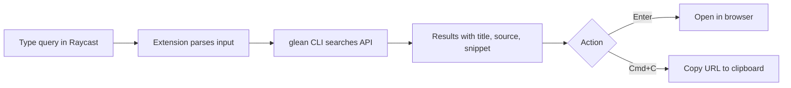

# Glean Search

Search your company's knowledge base via [Glean](https://glean.com) directly from Raycast.

The extension provides a fast, keyboard-driven interface to Glean's enterprise search. Type a query, get results with title, source, and snippet preview, then open in your browser or copy the URL -- all without leaving Raycast.

## Features

- **Quick search** -- start typing and results appear instantly
- **Rich results** -- title, datasource, and context snippets for every hit
- **Open in browser** -- press `Enter` to open a result in your default browser
- **Copy URL** -- press `Cmd+C` to copy a result's URL to the clipboard
- **Automatic CLI management** -- the `glean` CLI binary is downloaded and verified on first use
- **OAuth authentication** -- sign in through your browser with email-based instance discovery

## How it works

1. Install the extension from the Raycast Store
2. Open **Search Glean** in Raycast
3. If you are not signed in, the extension either:
   - Opens a browser for OAuth (if it knows your Glean server URL from a previous login), or
   - Asks for your work email to look up your Glean instance (first time)

Your work email is used once to discover your Glean instance. The server URL is cached in `~/.glean/config.json` for subsequent logins.

The `glean` CLI binary is auto-downloaded from GitHub Releases on first launch -- no manual installation needed.
