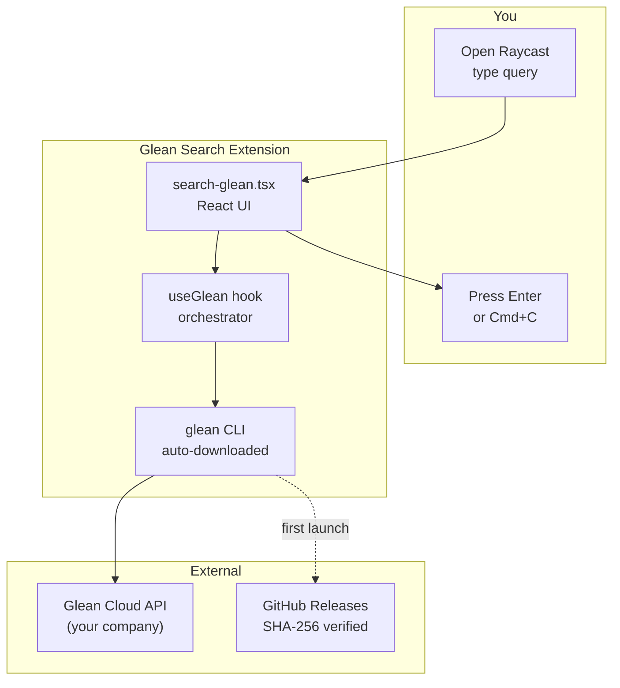
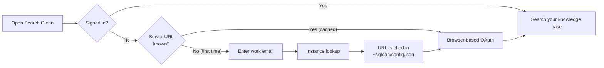

<p align="center">
  
</p>

<h1 align="center">Glean Search</h1>

<p align="center">
  <a href="https://github.com/faizhasim/glean-search/blob/main/LICENSE"></a>
  <a href="https://github.com/faizhasim/glean-search/actions"></a>
  <a href="https://www.typescriptlang.org"></a>
  <a href="https://vitest.dev"></a>
</p>

<p align="center">Search your company's knowledge base via <strong>Glean</strong> directly from <strong>Raycast</strong>.</p>

---

## What It Does

Start typing in Raycast, get results from your company's Glean-connected apps — Slack, Jira, Confluence, Google Workspace, GitHub, and more. Open a result or copy its URL, all from your keyboard.

| Feature | Description |
|---------|-------------|
| **Search across 100+ connectors** | Query indexed content from all your team's tools in one place |
| **Instant results** | Results appear as you type with title, datasource, and snippet preview |
| **Open in browser** | Press `Enter` to open any result in your default browser |
| **Copy URL** | Press `Cmd+C` to copy a result URL to the clipboard |
| **Zero configuration** | The Glean CLI is auto-downloaded and verified on first launch |
| **OAuth authentication** | Sign in via your browser with email-based instance discovery |

---

## How It Works



### Authentication



---

## Key capabilities

<div class="grid cards" markdown>

- **Auto-downloads glean CLI**

    The binary is downloaded from [GitHub Releases](https://github.com/gleanwork/glean-cli/releases), verified via SHA-256, and cached. No manual installation.

- **Email-based instance discovery**

    Enter your work email once to look up your Glean instance. The server URL is cached in `~/.glean/config.json` for subsequent use.

- **No preferences to configure**

    `gleanHost` and `gleanCliPath` preferences have been removed. The extension discovers everything automatically.

- **CLI delegation**

    All search and auth is handled by the official glean CLI. The extension wraps it in a Raycast-native UI.

- **24 test suite**

    [Vitest](https://vitest.dev) tests for auth, CLI discovery, and sign-in flows ensure reliability.

</div>

## Quick start

```bash
git clone https://github.com/faizhasim/glean-search.git
cd glean-search
npm install && npm run build
```

Then open **Search Glean** in Raycast. Sign in with your work email, and you're ready to search.

> **Note:** The extension is pending Raycast Store approval. Until then, install from source using the instructions above.

<sub>Not affiliated with Glean. Glean is a trademark of Glean Technologies, Inc.</sub>
