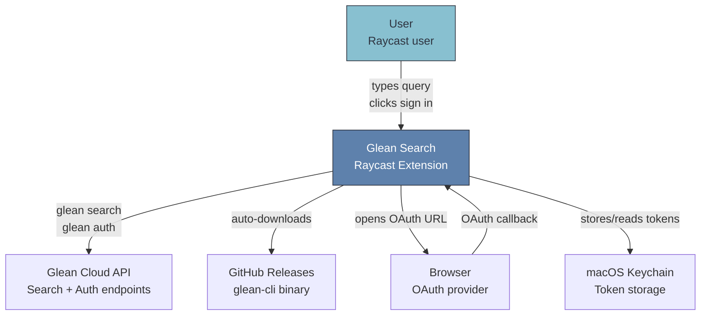
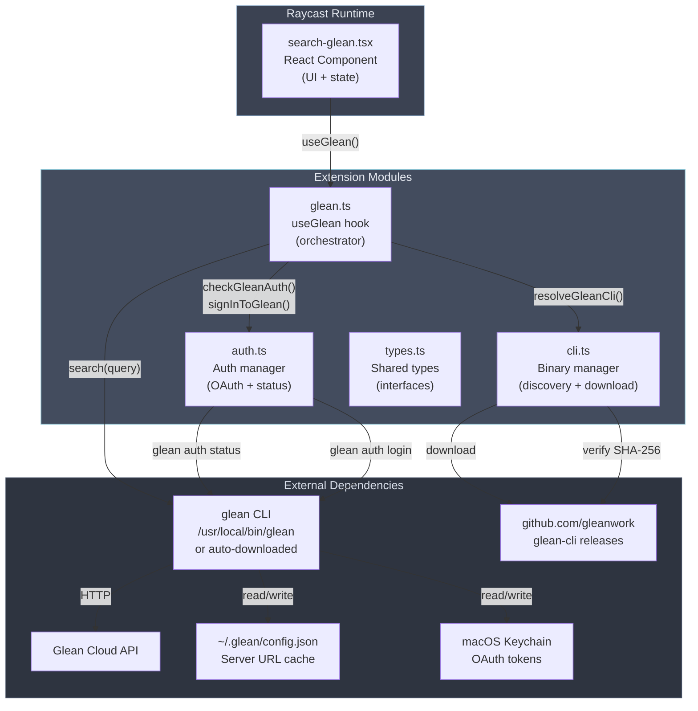
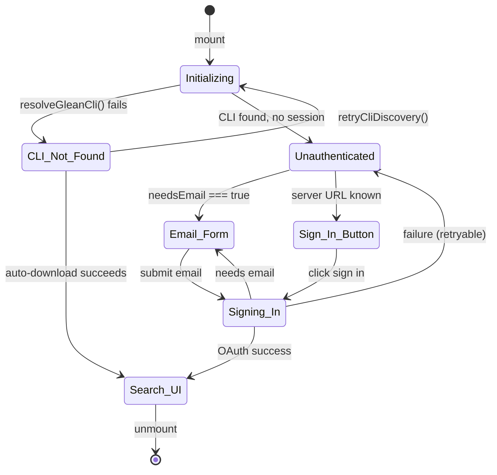
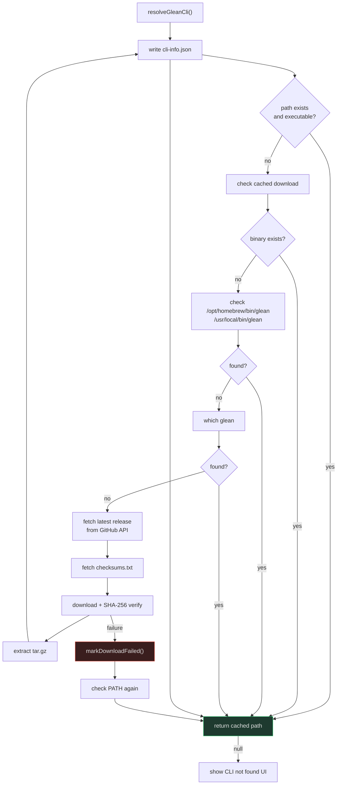
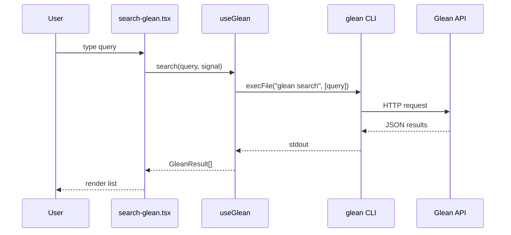

# Architecture

## C4 Level 1: System Context

The user interacts with Glean Search through Raycast. The extension delegates all search and authentication to the Glean CLI, which communicates with the Glean cloud API.



| Element | Description |
|---------|-------------|
| **User** | A person searching their company's knowledge base via Raycast |
| **Glean Search** | The Raycast extension (this project). Auto-downloads CLI, manages auth, executes search |
| **Glean Cloud API** | The Glean backend providing search and OAuth endpoints |
| **GitHub Releases** | Source of the pre-built `glean-cli` binary, verified via SHA-256 |
| **Browser** | OAuth 2.0 + PKCE flow opened in the user's default browser |
| **macOS Keychain** | Secure credential storage used by the Glean CLI |

---

## C4 Level 2: Container Diagram

The extension is a single Raycast command with four internal modules that orchestrate the Glean CLI.



| Container | Technology | Responsibility |
|-----------|-----------|----------------|
| **search-glean.tsx** | React (Raycast SDK) | Single command view. Renders search results, auth forms, error/loading states |
| **glean.ts** | TypeScript + React hooks | Orchestrates lifecycle: CLI discovery, auth checking, search execution |
| **auth.ts** | TypeScript + child_process | Reads `config.json`, runs `glean auth status/login`, parses output |
| **cli.ts** | TypeScript + https + child_process | Binary discovery chain, auto-download with SHA-256, caching |
| **types.ts** | TypeScript | `GleanResult`, `GleanSearchResponse`, `AuthInfo`, `GleanSnippet`, `GleanDocument` |

---

## C4 Level 3: Component Diagram

### search-glean.tsx — UI States



### glean.ts — Hook Lifecycle

```mermaid
flowchart LR
    subgraph Mount["On Mount"]
        A["resolveGleanCli()"] --> B{"binary found?"}
        B -->|"yes"| C["checkGleanAuth()"]
        B -->|"no"| D["show CLI not found"]
        C --> E{"authed?"}
        E -->|"yes"| F["show search UI"]
        E -->|"no"| G{"needsEmail?"}
        G -->|"yes"| H["show email form"]
        G -->|"no"| I["show sign in button"]
    end

    subgraph SignIn["On Sign In"]
        J["signInToGlean(path, email?)"]
        J --> K{"GLEAN_SERVER_URL set?"}
        K -->|"yes"| L["spawn with stdin closed"]
        K -->|"no, email provided"| M["pipe email to stdin"]
        L --> N["extract OAuth URL from output"]
        M --> N
        N --> O["open() via Raycast API"]
        O --> P["wait for CLI exit code 0"]
        P -->|"success"| Q["recheckAuth()"]
        P -->|"failure: reading email"| R["toggle needsEmail"]
    end

    subgraph Search["On Search"]
        S["AbortController.abort() prev"]
        T["search(query, signal)"]
        T --> U["execFile(\"glean search\")"]
        U --> V["parse JSON response"]
        V --> W["setResults(items)"]
    end
```

### cli.ts — Binary Discovery Chain



---

## Data Flow

### Search Sequence



### Authentication Sequence


---

## Design Decisions

| Decision | Rationale |
|----------|-----------|
| **CLI delegation** over library integration | Official Glean client -- reduced maintenance, guaranteed API compatibility |
| **Auto-download** over bundling | Smaller package, independent version updates, SHA-256 verified |
| **React hooks** for state management | Stable API surface via `useCallback`, no unnecessary re-renders |
| **AbortController** for search | Prevents stale results on fast typing, clean cancellation |
| **spawn over execFile** for auth | Real-time stdout capture for OAuth URL extraction, stdin control |
| **Config file over preference** | `~/.glean/config.json` persists across extension re-installs |

<sub>Not affiliated with Glean. Glean is a trademark of Glean Technologies, Inc.</sub>
