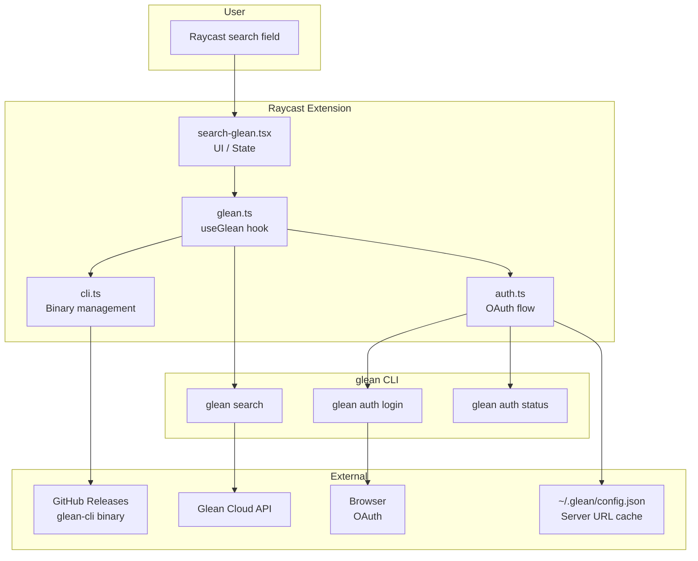
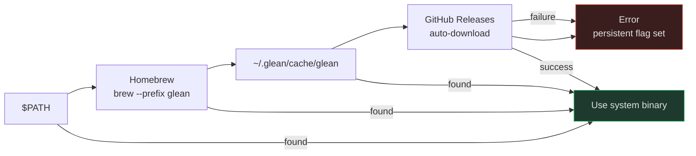
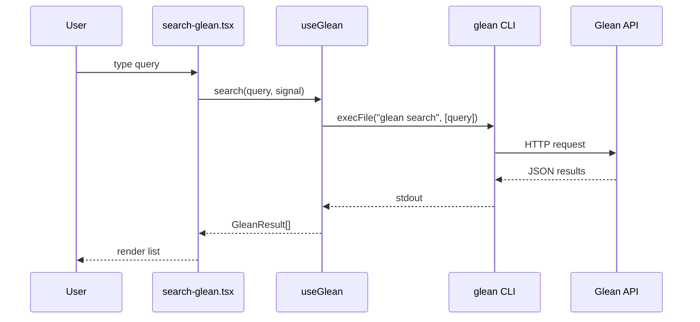
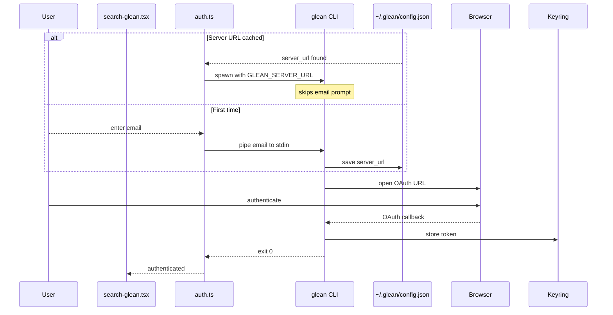
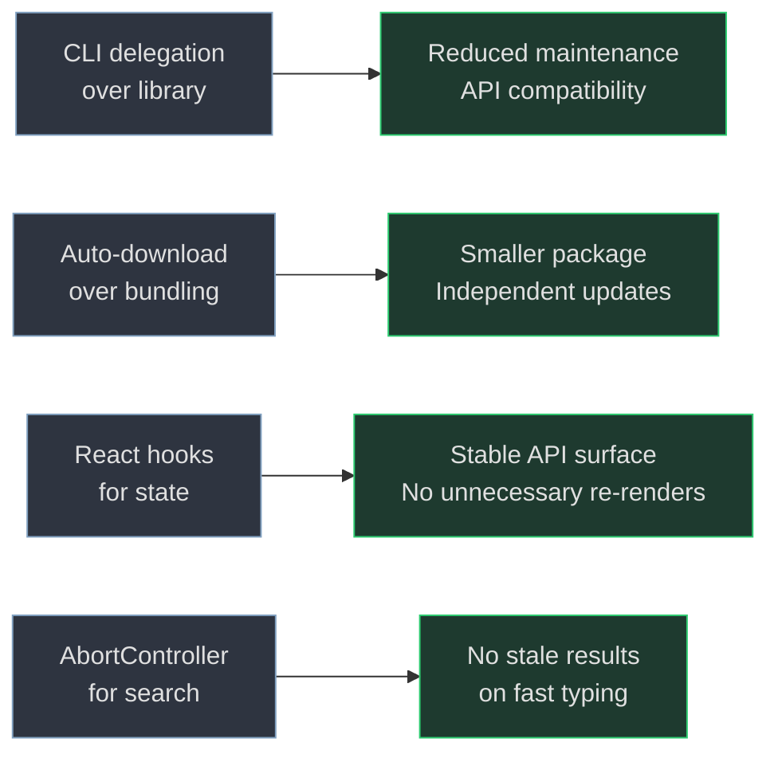

# Architecture

## Overview

Glean Search is a Raycast extension implemented as a single-view React component. It delegates all Glean interactions to the official Glean CLI, which is auto-downloaded on first use.

## Modules

### `src/search-glean.tsx`

The Raycast command entry point. A React component that renders the search interface and handles user interactions. It uses the `useGlean` hook to manage extension lifecycle.

**States handled:**

- Initializing -- CLI binary resolving, auth checking
- CLI not found -- prompts user to retry or check network
- Not authenticated -- email form or OAuth flow
- Auth error -- displays error with retry
- Authenticated search -- results list with actions

### `src/lib/glean.ts`

The `useGlean` React hook that orchestrates the extension lifecycle:

1. **CLI discovery** -- calls `resolveGleanCli()` on mount to find or download the binary
2. **Auth checking** -- calls `checkGleanAuth()` to verify the current session
3. **Sign-in** -- calls `signInToGlean()` when the user initiates authentication
4. **Search** -- executes `glean search <query>` via `execFile`, parses JSON output

The hook exposes a stable API (`search`, `signIn`, `recheckAuth`, `retryCliDiscovery`) via `useCallback` to avoid unnecessary re-renders.

### `src/lib/cli.ts`

Manages the Glean CLI binary lifecycle:

- **Resolution** -- attempts common paths in order, falling back to auto-download
- **Auto-download** -- fetches the latest release from GitHub, verifies SHA-256, marks errors persistently to avoid repeated failure loops
- **Caching** -- stores version and checksum in `cli-info.json` alongside the binary

The download uses Node.js `https` module with redirect following (up to 10 hops) and streams directly to disk.

The resolution chain follows this priority:

### `src/lib/auth.ts`

Handles Glean authentication:

- **Config reading** -- reads `~/.glean/config.json` to discover the Glean server URL
- **Auth check** -- runs `glean auth status` and parses the output to determine authentication state
- **Sign-in** -- spawns `glean auth login` with stdin closed, captures the OAuth URL from CLI output, and opens it via Raycast's `open()` API. Falls back to an email prompt if `GLEAN_SERVER_URL` is not yet cached.

### `src/lib/types.ts`

Shared TypeScript interfaces:

- `GleanResult` -- a single search result (title, URL, document, snippets)
- `GleanSearchResponse` -- the full API response (results, cursor, pagination)
- `AuthInfo` -- authentication state (authenticated, unauthenticated, error)
- `GleanSnippet` -- a text snippet with MIME type
- `GleanDocument` -- document metadata (datasource, doc type, title, URL)

## Data flow

### Search

### Authentication

## Design decisions

- **CLI delegation** over library integration -- the Glean CLI is the official client, reducing maintenance burden and ensuring API compatibility
- **Auto-download** over bundling -- keeping the binary out of the extension repository avoids bloating the package and allows independent updates
- **React hooks** for state management -- using `useCallback` and `useRef` avoids unnecessary re-renders while keeping the API surface stable
- **AbortController** for search cancellation -- prevents stale results from appearing when the user types quickly
